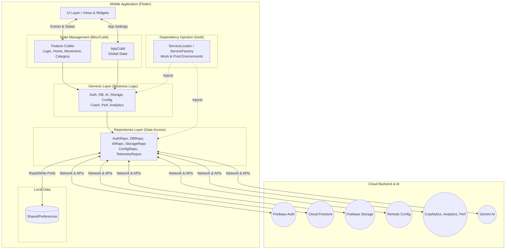

# Saver Expense Manager

Welcome to the comprehensive documentation for the **Saver Expense Manager** application. This guide covers all key Dart files, organized by functional modules, explains their responsibilities, and illustrates how they interconnect to manage users, movements, and categories using Firebase as the backend.

---

## 📑 Table of Contents

1. [Architecture](#%EF%B8%8F-architecture)
2. [App Core](#app-core)
   2.1 [State Management](#state-management)
   2.2 [Global Utilities](#global-utilities)
   2.3 [Routing & Themes](#routing--themes)
   2.4 [Services](#services)
   2.5 [UI Layer (View & Widgets)](#ui-layer-view--widgets)
3. [Feature Modules](#feature-modules)
   3.1 [Login & Register](#login--register)
   3.2 [Home](#home)
   3.3 [Movement](#movement)
   3.4 [Category](#category)
   3.5 [Profile](#profile)
   3.6 [Settings](#settings)
4. [Localization (l10n)](#localization-l10n)
5. [Bootstrap & Entrypoint](#bootstrap--entrypoint)
6. [Packages & Data Models](#packages--data-models)
7. [Configuration (`pubspec.yaml`)](#configuration-pubspecyaml)

---

# 🏗️ Architecture

- **UI (Flutter Interface)**: Standardized presentation layer that sends events to the State and interacts with the Services.
- **State (Bloc/Cubit)**: Manages the application logic, handles read/write operations with the Local DB, and interacts with external services.
- **Store (Local DB - SharedPreferences)**: Handles local data persistence on the device for quick access and preferences.
- **Services & Repositories**: Follows a strict Repository Pattern. Repositories handle raw data access while Services manage business logic. Connected via Dependency Injection (`get_it`).
- **Backend**: Firebase provides the core backend infrastructure (Auth, Firestore, Storage, Telemetry), while Gemini AI adds smart capabilities to the app.

---

## App Core

### 1. State Management

| File                             | Role                                                                                          |
|----------------------------------|-----------------------------------------------------------------------------------------------|
| **lib/app/cubit/app_cubit.dart** | Manages **global app state**: core configurations and fundamental app states during runtime. |
| **lib/app/cubit/app_state.dart** | Immutable state variables serving core elements. Supports `copyWith`.        |

---

### 2. Global Utilities

| File                             | Role                                                                                          |
|----------------------------------|-----------------------------------------------------------------------------------------------|
| **lib/app/helpers/***            | Collection of UI/data helper functions for app-wide UI/logic processing. |
| **lib/app/global/***             | App-wide constants, strings, routing, themes, and dependencies configuration variables. |

---

### 3. Routing & Themes

| File                                  | Role                                                                                  |
|---------------------------------------|---------------------------------------------------------------------------------------|
| **lib/app/global/app_router.dart**    | Defines the `GoRouter` navigation graph defining paths to login, home, movements, settings, etc. |
| **lib/app/global/app_themes.dart**    | Defines light and dark themes using `ThemeData` to adjust UI accents, card shapes, and typography. |
| **lib/app/global/app_dependencies.dart** | Configuration setup for singletons and dependency injection (using `get_it`). |

---

### 4. Repositories & Services Layer

The application implements a Repository Pattern connected via Dependency Injection (`get_it` & `ServiceFactory`). This separates data acquisition from business logic and heavily improves testability through mock environments.

| Layer | Responsibility | Key Files |
|-------|----------------|-----------|
| **Repositories** (`lib/app/repositories/`) | Handles raw data access and external API communication. Built to support `Mock` and `Prod` implementations. | `auth_repository.dart`, `database_repository.dart`, `crash_repository.dart`, etc. |
| **Services** (`lib/app/services/`) | Contains the core business logic, orchestrating internal repository calls and exposing clean APIs to the Cubits. | `auth_service.dart`, `database_service.dart`, `crash_service.dart`, etc. |

**Key Capabilities:**
- **Infrastructure & Telemetry**: `CrashService`, `PerformanceService`, `AnalyticsService` for robust Firebase App tracking and Crashlytics error logs.
- **Config & Local Storage**: `LocalStorageService` (SharedPreferences) and `RemoteConfigService` (Firebase Remote Config).
- **Authentication**: `AuthService` handling Google & Email Sign-In via `AuthRepository`.
- **Data & Remote Storage**: `DatabaseService` (Firestore CRUD features) and `RemoteStorageService` (Firebase Storage uploads).
- **Business / AI**: `AiService` interacting with Gemini AI for document scanning and parsing capabilities.

---

### 5. UI Layer (View & Widgets)

#### View

| File                               | Role                                                                                          |
|------------------------------------|-----------------------------------------------------------------------------------------------|
| **lib/app/view/app_page.dart**     | Top-level widget setting up application provider injections linking the bloc logic to the widget tree. |
| **lib/app/view/app_view.dart**     | Consumes `AppCubit`, and configures `MaterialApp` including themes, routing, and l10n. |

#### Widgets

| File                          | Role                                                                                                             |
|-------------------------------|------------------------------------------------------------------------------------------------------------------|
| **lib/app/widgets/***         | Global shared UI custom components (buttons, text fields, charts, pickers, dialogs).                             |
| **lib/app/animations/***      | Custom reusable animation widgets for loading states, transitions, and dynamic UI elements.                      |

---

## Feature Modules

Each feature follows a standard Bloc/Cubit architecture pattern structure:
1. **barrel** file exporting components.
2. **Cubit**: `feature_cubit.dart` + `feature_state.dart`.
3. **Page**: Stateless widget providing the specific cubit.
4. **View**: Stateful or stateless widget using a state builder to display the UI depending on logic emitted by the cubit.

---

### Login & Register

- **lib/login/***  
- **lib/register/***  

**Features:**  
Handles user onboarding, authentication via email/password or Google, and account creation processes linking seamlessly with `AuthenticationService`.

---

### Home

- **lib/home/***  

**Highlights:**  
- Acts as the main application dashboard exposing recent movements, expense summaries, and charts.
- Utilizes `syncfusion_flutter_charts` to format data cleanly for expense tracking analysis.

---

### Movement

- **lib/movement/***  

**Capabilities:**  
- Data entry forms dedicated to generating or updating `Movement` models (incomes/expenses, amounts, categories, dates, receipts) stored in Firestore.
- Supports AI-assisted receipt scanning for automatic data extraction.

---

### Category

- **lib/category/***  

**Features:**  
- Interface for creating, editing, and managing custom expense categories. Includes icon selection and color picking to personalize the financial tracking experience.

---

### Profile & Settings

- **lib/profile/***  
- **lib/settings/***  

**Controls:**  
- **Profile**: Manages user-specific data, avatars, and account details.
- **Settings**: Unified hub altering universal parameters (theme configurations, localization language). Passes preferences backward to be maintained securely inside `LocalStorageService`.

---

## Localization (l10n)

| File                               | Role                                                  |
|------------------------------------|-------------------------------------------------------|
| **lib/l10n/app_en.arb**            | English string dictionary values.                     |
| **lib/l10n/app_es.arb**            | Spanish translation map values.                       |
| **lib/l10n/app_it.arb**            | Italian translation map values.                       |
| **lib/l10n/gen/***                 | Folder containing dynamically generated delegates.    |

**Mechanism:** Utilizing Flutter standard `l10n` capabilities based on `.arb` file configurations generating standard translation accessors.

---

## Bootstrap & Entrypoint

| File                          | Role                                                                                   |
|-------------------------------|----------------------------------------------------------------------------------------|
| **lib/bootstrap.dart**        | Intercepts application initialization, configuring error logging and calling `runApp()`. |
| **lib/main.dart**             |    1. Triggers initial execution context.   2. Sets up `AppDependencies` initializing singletons and Firebase.   3. Dispatches execution flow over to `bootstrap`. |

---

## Packages & Data Models

Saver Expense Manager uses remote synchronization through Firebase while maintaining a clean entity structure locally.

### Data Models

- **lib/app/models/app_user.dart**: Represents the authenticated user profile.
- **lib/app/models/movement.dart**: Contains the parameters of an individual financial transaction (amount, date, description, receipt).
- **lib/app/models/category.dart**: Represents user-defined categories for grouping movements.
- **lib/app/models/linear_chart_data.dart** & **category_expense_data.dart**: Custom models structured for rendering UI charts.

These classes interact seamlessly as the main underlying format populating the application views.

---

## Configuration & Testing

### Configuration (`pubspec.yaml`)

- Core dependencies defining internal toolings: `flutter_bloc` & `equatable` (handling deterministic state propagation), `firebase_core` framework suite (backend infrastructure), `go_router` (URI routing maps), and `syncfusion_flutter_charts` (data visualization).
- Defines environment constraints formatting image assets and providing AI interaction via `firebase_ai` and `gemini_nano_android`.
- Analyzers: Built on robust CI pipelines ensuring code quality with `very_good_analysis` linter rules.

### Testing Architecture

The project has been refactored to support robust, isolated testing environments leveraging the DI container (`get_it`):
- **Mock Environments**: Replaces production repositories by instantiating `Environment.mock` in `ServiceFactory`. Yields classes like `MockAuthRepository` or `MockDatabaseRepository` natively without relying on network requests.
- **Service & Logic Verification**: Feature Cubit and Widget View tests heavily utilize `mocktail` to verify service interactions, proper state emissions, navigation flows, and bottom sheet logic reliably.
- CI/CD ensures green status tests on pull requests over `beta.yaml`.

---

> **Enjoy building and extending the Saver Expense Manager app!**
